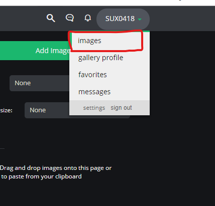
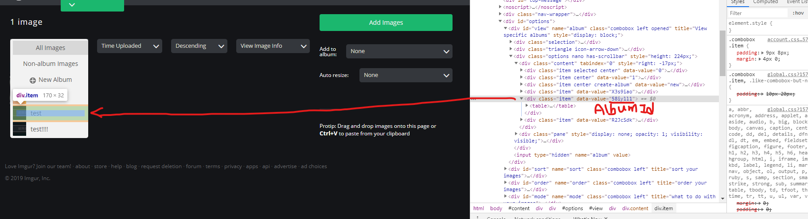
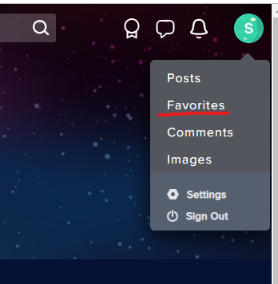
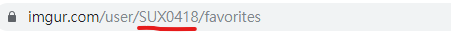

# API 使用筆記
### 初始化
```python
client_id = 'YOUR ID'
client_secret = 'YOUR SECRET'
api = API(client_id, client_secret)
```

###取得相簿所有圖片網址

```python
api = API(client_id, client_secret)
api.get_album_image_urls('相簿ID')
```
登入帳號後



在F12裡面看Albym Id



----------
### 取得 favorites 的所有圖片網址

```python
api.get_favorites_image_urls("UserName"))
```
####第一步


紅線的地方是你的UserName<br>
<br>

```python
print後的結果:
['https://i.imgur.com/EiX3ZLT.png']
['https://imgur.com/gallery/R2JcSdk', 'https://imgur.com/gallery/Ve0Ha59']

```